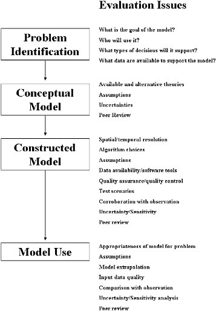

```{r setup, include=FALSE}
knitr::opts_chunk$set(echo = FALSE)
```

## Background

This document provides criteria for consistent review of models by the multispecies assessment working group of the International Council for the Exploration of the Sea (ICES WGSAM). For nearly a decade, WGSAM has reviewed model "key runs" as part of its Terms of Reference. Recently, WGSAM reviewed key runs for the North Sea SMS model in 2014 and 2017, the North Sea EwE model in 2015, and the Baltic EwE model in 2016. Key run reviews are scheduled for Baltic Sea Gadget and SMS models and the Irish Sea EwE model in 2019. 

WGSAM Term of Reference b for 2019-2021 reads:

>Update of key-runs (standardized model runs updated with recent data, producing agreed output and agreed upon by WGSAM participants) of multispecies and ecosystem models for different ICES regions. The key runs provide information on natural mortality for inclusion in various single species assessments. Deliverables: Report on output of multispecies models including stock biomass and numbers and natural mortalities for use by single species assessment groups and external users.

Because WGSAM is increasingly asked to provide model framework reviews as well as key run reviews, we have drafted this document to provide consistent guidelines and review critiera for both reviewers and groups submitting models for review. Guidelines are based on experience from past reviews (see WGSAM reports from 2013-2018 as well as, e.g., https://www.st.nmfs.noaa.gov/science-quality-assurance/cie-peer-reviews/peer-review-reports) as well as best practices outlined in the literature [@nrc_chapter_2007; @kaplan_guinea_2016].

## Model Life Cycle and Objectives for Evaluation

The U.S. National Research Council has summarized the general objectives for model evaluation and tailored them to different stages of the model life cycle with reference to models used in enviromental regulation processes[@nrc_chapter_2007]. The application of multispecies and ecosystem models within fishery management processes is similar enough that this summary provides a useful framework for our criteria. 

The genereal objectives of model review are threefold:[@nrc_chapter_2007], p 108

>Is the model based on generally accepted science and computational methods?  
Does it work, that is, does it fulfill its designated task or serve its intended purpose?  
Does its behavior approximate that observed in the system being modeled?  

The model life cycle further specifies review priorities. 

```{r lifecycle, fig.cap="Model Life Cycle, NRC 2007, redraw this poor quality figure", out.width='50%', fig.align='center'}

```

WGSAM receives most requests for model review after the problem identification and conceptual model stage. However, it is important to provide documentation of these processes to reviewers so that the completed model can be evaluated. 

In addition, models involved in a management process may face the tradeoff between complexity and transparency, where the need to account for many interactions and processes may render the model harder to explain, and perhaps accept, by decision-makers [@nrc_chapter_2007]. Because the audience for WGSAM key runs tends to be other scientsts, evaluating the extent to which models are transparent to a scientific, stock assessment oriented audience is appropriate here.

We consider WGSAM reviews to be "peer review".

>Peer review attempts to ensure that the model is technically adequate, competently performed, properly documented, and satisfies established quality requirements through the review of assumptions, calculations, extrapolations, alternate interpretations, methodology, acceptance criteria, and/or conclusions pertaining from a model or its application.[@nrc_chapter_2007]

## Key Run Reviews

As described above, model key runs are currently used to provide inputs to other assessment models; specifically, natural mortality ($M$) time series. This places key runs clearly within the "Model Use" phase of the life cycle. This means that reviews should evaluate (from the figure above):

1. Appropriateness of the model for the problem (problem identification)
1. Assumptions (scientific basis, computational infrastructure; adequacy of conceptual model)
1. Model extrapolation (*unsure what this means: extension of a model framework for this particular application? extrapolations made to get it up and running? using it beyond the data it was parameterized with?*)
1. Input data quality
1. Comparison with observations
1. Uncertainty/sensitivity analysis
1. Peer review (WGSAM's role, but consider previous reviews from model construction)

Reviewers will rely on submitted documentation to address these issues. At each point, if documentation is inadequate to address the problem, that will be noted. Review criteria for each point are outlined below.

### Is the model appropriate for the problem?

Define the problem, and why this model is or is not appropriate

For example, is a total mortality time series enough or does the time series need to be M by age? What other outputs are used in the assessments?

From Daniel on model purpose for the WKIRISH:

>The aim with the Irish Sea Ecopath is to use the model to “fine tune” the quota advice within the predefined EU Fmsy ranges. In “good” conditions you could fish at the top of the range, in “poor” conditions you should fish lower in the range. The range has already been evaluated as giving good yield while still being precautionary, so this should be fine for ICES to use in advice, so any reviewers should have this in mind.

### Is the scientific basis of the model sound?

This could get deep.

### Whatever model extrapolation means?


### Is the input data quality sufficient for the problem?

See above defining the problem. Which datasets are adequate, which could be improved, and which are missing?

### Does model output compare well with observations?

Here we refer to the more detailed performance criteria developed in @kaplan_guinea_2016. 

1. All functional groups persist

1. Model stabilizes for the last ~20 years of an unfished, unperturbed 80-100 year run

1. Hindcast period established where we have survey/assessment time series with error bounds

1. Species groups totaling ~80% of system biomass should qualitatively match hindcast biomass trends

1. Patterns of temporal variability captured (emergent or forced with e.g. recruitment time series)

1. Productivity for groups totaling ~80% of system biomass should qualitatively match FMSY or life history expectations

1. Natural mortality decreases with age for majority of groups

1. Age and length structure qualitatively matches expectations for majority of groups

1. Diet predicted qualitatively matches empirical diet comp for majority of groups

### Uncertainty

Has uncertainty been assessed in the output of interest? Has sensitivity analysis been performed and how does it affect those outputs?

For complex models with long runtimes, simpler ways to address uncertainty may be appropriate [@kaplan_guinea_2016].

Best practice is to retain multiple parameterizations that meet the above criteria to allow scenario testing across a range of parameterizations. Parameter uncertainty can be addressed even in complex models. A simple method uses bounding (e.g. base, low bound, and high bound productivity scenarios).

### Previous peer review

What did they point out and have issues been addressed?

Review of constructed models should have evaluated spatial and temporal resolution, algorithm choices, data availability and software tools, quality assurance/quality control of code, and test scenarios. Please 

## General Model Reviews

WGSAM has provided model framework reviews for the LeMans ensemble (2016), FLBEIA (2017), and a multispecies state-space model (2017). Here we outline more general model framework review guidelines for future meetings.

Model frameworks may be at different stages of the model life cycle than the key runs described above, although to date WGSAM has received requests for review closest to the "Constructed Model" phase. This means that reviews should evaluate (from the figure above):

1. Spatial and temporal resolution
1. Algorithm choices
1. Assumptions (scientific basis, computational infrastructure; adequacy of conceptual model)
1. Data availability/software tools
1. Quality assurance/quality control (code testing)
1. Test scenarios
1. Corroboration with observations
1. Uncertainty/sensitivity analysis
1. Peer review (WGSAM's role, but consider previous reviews from prior steps)

### Spatial and temporal resolution

Does the model address the scales appropriate to its proposed use? Or, reviewers should identify what spatial and temporal scale the model is best suited to.

### Algorithm choices

### Assumptions (scientific basis, computational infrastructure; adequacy of conceptual model)

### Data availability/software tools

### Quality assurance/quality control (code testing)

Has code been made available to reviewers? While a full code review is beyond the scope of WGSAM, reviewers with expertise in a particular model type may ask to review portions of the model code and/or data inputs. 

### Test scenarios

### Corroboration with observations

Once again, criteria developed by @kaplan_guinea_2016 are relevant; see above.

### Uncertainty/sensitivity analysis

### Peer review (WGSAM's role, but consider previous reviews from prior steps)


## References


