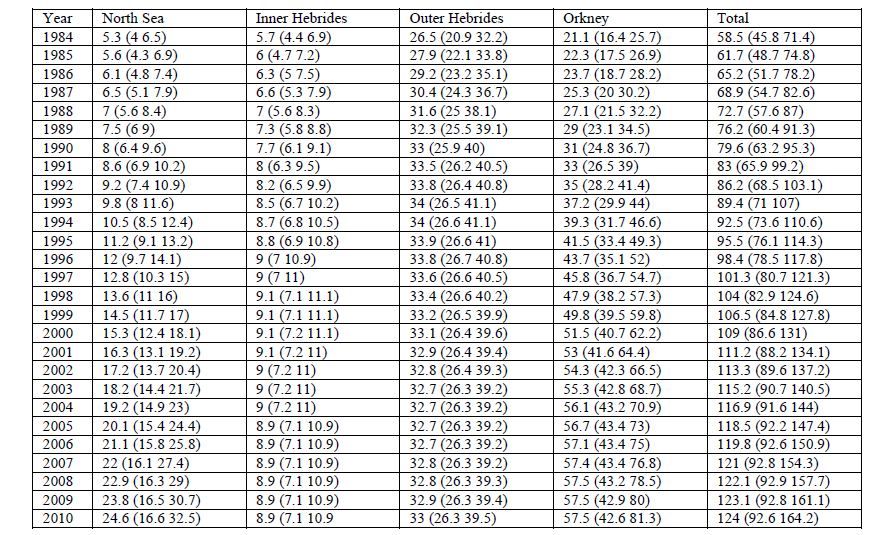

# Data used in the previous keyrun

Grey seal numbers have not been updated since the 2011 keyrun. According to the SMS stock annex, grey seal numbers from @thomas2011 were used for 1984-2009 (North Sea and Orkney). The numbers for the period prior 1984 are estimated assuming exponential growth in 1984-1990, and the numbers after 2009 are assumed equal to the 2009 value as the population seemed to be leveling off. 
@thomas2011 seal estimates are given for the beginning of the breeding season, which corresponds more or less to quarter 4.
The seal numbers in quarter 4 in the 2017 keyrun are given in Table \@ref(tab:tabOrig). There is a decrease in seal numbers between Q4 in one year and Q1-3 in the next year (around 12-17\%), probably to account for seal mortality after the breeding counts, however it was not possible to find a systematic method for getting these values, and this was not mentioned in the stock annex.

```{r tabOrig, echo=FALSE}
load("sealN.RData")

scale <- c("1985"=1.231, "2002"=1.112, "2010"=1.0816, "2019"=1.0671, "2022"=1.065)
new.est =subset(sealN, Year %in% names(scale))$TotalNS*scale

sealN$TotalNSscaled <- NA
sealN[which(sealN$Year %in% names(new.est)),"TotalNSscaled"] <- new.est

knitr::kable(original[c("year", "N")], format = "latex", caption = "Seal numbers (thousands) in quarter 4 used in the 2017 keyrun")
```

More importantly, it was not possible to reproduce the numbers from the 2017 keyrun. Indeed @thomas2011 proposes two tables for seal numbers following two different estimation methods. None of the tables matches the seal numbers in the 2017 keyrun (Figures \@ref(fig:thomas11a) and \@ref(fig:thomas11b)). Number in the 2017 keyruin are actually closer to the total estimates including seals in Div. 6a rather than the sum of the estimates for North Sea and Orkney.

```{r thomas11a, fig.cap="Seal estimates from Thomas (2011)", out.width="100%", echo=FALSE}

```

```{r thomas11b, fig.cap="Seal estimates from Thomas (2011)", out.width="100%", echo=FALSE}

```

According to @thomas2021, the grey seal number estimates relate to seals associated with the regularly monitored colonies. A multiplier is required to account for the seals that breed outside these colonies. 
This might be the reason why I cannot reproduce the numbers.

In addition, after discussions with scientists at SMRU, the population estimates from the SCOS reports are for the population that pups on the British side of the North Sea. There are estimates for grey seals elsewhere in the North Sea that should be available in the OSPAR assessment report.

\clearpage

# Most recent seal numbers data

## Extrapolate data for 1984-2022

Most recent grey seal numbers comes from @thomas2021 and include estimates for the period 1984-2020. Seal numbers from 2021-2022 were obtained via personal communication (Phil Hammond (SMRU)).

Multipliers on the grey seal estimates to account for non-monitored colonies were made available for the years `r paste(names(scale), collapse=", ")` (pers. comm. Phil Hammond (SMRU)).
Estimates for 1984-2022, were therefore extrapolated to the full British colonies following a linear regression between the scaled estimates (Figure \@ref(fig:sealdata)). 

```{r sealdata, fig.cap="Seal estimates from Thomas (2021, 1984-2020) and provided by SMRU (2021-2022) in thousands in black. The green dots show the known estimates scaled to all British colonies. The red dots are the extrapolated numbers for the missing years. The line illustrate the linear regression used to extrapolate the estimates.", fig.dim=c(6,6), echo=FALSE}
test0 <- lm(TotalNSscaled~Year, data=sealN)
tmp0 <- predict(test0, newdata=data.frame(Year=1984:2022))
names(tmp0) <- 1984:2022
sealN$TotalNSfinal <- sealN$TotalNSscaled
idx <- sealN$Year[is.na(sealN$TotalNSfinal)]
sealN$TotalNSfinal[which(sealN$Year %in% idx)] <- tmp0[which(names(tmp0) %in% idx)]

plot(sealN$TotalNS~sealN$Year, xlim=c(1974,2022), ylim=c(0,150), pch=16, xlab="", ylab="Seal numbers (thousands)")
points(sealN$TotalNSfinal~sealN$Year, pch=16, col="red")
points(sealN$TotalNSscaled~sealN$Year, pch=16, col="green")
abline(test0)
```


## Extrapolate data prior for 1974-1983

Numbers prior to 1984 are predicted following a linear regression in the log scale so that the population is assumed to have an exponential growth in the period 1984-1990 (similar method than for the 2017 keyrun) (see Figure \@ref(fig:fit)). 

The corresponding seal numbers on the natural scale are given in Figure \@ref(fig:sealN)). Given that the estimates of @thomas2021 account for pup survival, we propose to assume the same seal numbers for all quarters (Q1-Q4). Contrary to the last keyrun, the seal population does not seem to level off on the natural scale.

```{r fit, fig.cap="Seal extrapolated estimates for 1984-2022 in black. The green dots show the known estimates scaled to all British colonies. In red are the predictions for 1974-1983 following the linear regression highlighted by the line.", fig.dim=c(6,6), echo=FALSE}

plot(log(sealN$TotalNSfinal)~sealN$Year, xlim=c(1974,2022), ylim=c(2,log(150)), pch=16, xlab="", ylab="log(seal numbers)")
points(log(sealN$TotalNSscaled)~sealN$Year, pch=16, col="green")
test1 <- lm(log(TotalNSfinal)~Year, data=subset(sealN, Year %in% 1984:1990))
#summary(test1)
abline(test1)
tmp1 <- predict(test1, newdata=data.frame(Year=1974:1983))
names(tmp1) <- 1974:1983
points(tmp1~names(tmp1), pch=16, col="red")

extra_pts <- matrix(ncol=ncol(sealN), nrow=length(1974:1983))
colnames(extra_pts) <- colnames(sealN)
extra_pts[,"Year"] <- 1974:1983
extra_pts[,"TotalNSfinal"] <- exp(tmp1)

sealN <- rbind(extra_pts, sealN)
```


## Seals outside of the UK

```{r pup, echo=FALSE}
pupCount <- c("Norway south of 62N"=35, "Wadden Sea"=1927, "Dutch Delta Area"=23, "Scottish North Sea"=32213, "English North Sea"=10725)

propOut <- sum(pupCount[c("Norway south of 62N", "Wadden Sea", "Dutch Delta Area")])/sum(pupCount)

sealN$FinalAllNS <- sealN$TotalNSfinal*(propOut+1)

knitr::kable(cbind(pupCount), format = "latex", caption = "Pup counts in the North Sea taken from ICES 2022.")
```

@WGMME2022 provides pup counts for different areas of the North Sea. The colonies in the North Sea were extracted (Table \@ref(tab:pup)). Proportion of the pup counts outside the UK was estimated using these estimates and resulting in a proportion of around `r round(propOut,3)`. While this is a strong assumption, a multiplier of around `r round(propOut+1,3)` was applied to our British grey seal population estimates to extrapolate the numbers to the entire North Sea grey seal population. the final estimates are illustrated in orange in Figure \@ref(fig:sealN).


```{r sealN, fig.cap="British grey seal estimates in thousands in black. The green dots illustrates the know non-extrapolated estimates. The blue dots show the number used in the 2017 keyrun. The orange dots represent the estimates where the British seal estimates were scaled up to account for the grey seals in the rest of the North Sea.", fig.dim=c(6,6), echo=FALSE}

# On natural scale
plot(sealN$TotalNSfinal~sealN$Year, xlim=c(1974,2022), ylim=c(0,150), pch=16, xlab="", ylab="Seal numbers (thousands)")
points(sealN$TotalNSscaled~sealN$Year, pch=16, col="green")
#points(exp(tmp1)~names(tmp1), pch=16, col="red")
points(original$N~original$year, pch=16, col="blue")
points(sealN$FinalAllNS~sealN$Year, pch=16, col="orange")
```

\clearpage

# Conclusions

The group decided to use the orange estimates as the final numbers for the 2023 North Sea keyrun. These are given in Table \@ref(tab:final)

```{r final, echo=FALSE}

knitr::kable(sealN[,c("Year", "FinalAllNS")], format = "latex", caption = "Grey seal numbers (thousands) use for the 2023 North Sea keyrun.", digits = 3)
```


```{r, echo=FALSE}
## Make csv for Morten
tmp <- read.csv("GSE_HBP_2020keyrun.csv")

table <- matrix(ncol=ncol(tmp), nrow=length(rep(sealN$Year,4)))
colnames(table) <- colnames(tmp)
table <- data.frame(table )
table$year <- sort(rep(sealN$Year,4))
table$species <- "GSE"
table$species.n <- 13
table$age <- 1
table$quarter <- rep(1:4, nrow(table)/4)
table$sub_area <- 1
table$WSEA <- 10

for (y in unique(table$year)){
  table[which(table$year==y),]$N <- subset(sealN, Year==y)$FinalAllNS
}

table <- rbind(table, subset(tmp, species=="HBP"))
# Add extra years for HBP, same as before, no new data
extra_lines <- table[nrow(table)+-11:0,]
extra_lines$year <- extra_lines$year+3
table <- rbind(table, extra_lines)

rownames(table) <- NULL

write.csv(table, file="GSE_HBP.csv", quote=FALSE, row.names=FALSE)

```

\clearpage

# References